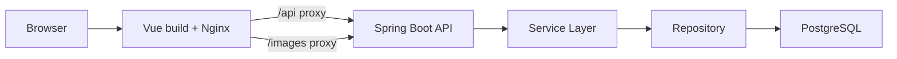
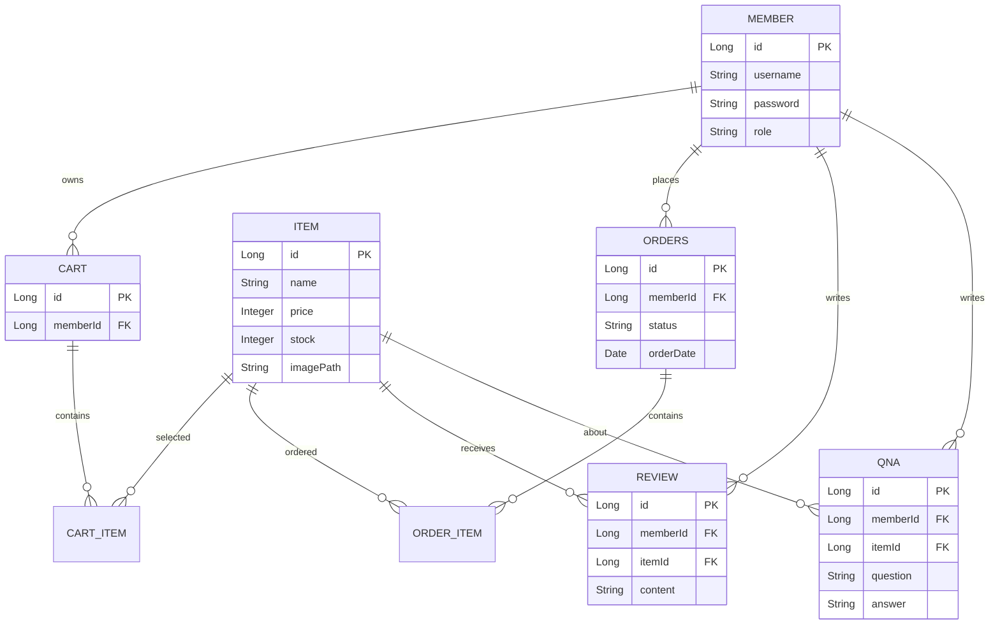

# Logitech Store Shopping Mall

Vue 3와 Spring Boot, PostgreSQL을 분리형 구조로 연결한 개인 쇼핑몰 프로젝트입니다. 회원, 상품, 장바구니, 주문, 리뷰, Q&A, 관리자 기능을 구현하고 Docker Compose 기반 실행 환경까지 정리했습니다.

## 1. 프로젝트 개요

- 프로젝트명: Logitech Store Shopping Mall
- 개발 형태: 개인 미니 프로젝트
- 주제: Logitech 마우스 판매 쇼핑몰
- 목적: Vue 프론트엔드와 Spring Boot REST API, PostgreSQL DB를 연결한 풀스택 쇼핑몰 흐름 구현
- 저장소: https://github.com/woongpro416/logitech

## 2. 주요 기능

- 회원가입, 로그인, 로그아웃, 로그인 상태 확인
- 상품 목록, 상품 상세, 카테고리별 상품 조회
- 장바구니 상품 추가, 조회, 삭제
- 주문 생성, 주문 내역 조회, 주문 상세 조회
- 리뷰 등록, 수정, 삭제
- Q&A 질문/답변 등록, 수정, 삭제
- 관리자 대시보드, 회원/상품/주문/리뷰/Q&A 관리
- Docker Compose 기반 frontend/backend/postgres 통합 실행

## 3. 담당 역할

- Vue 3 화면, Vue Router, Pinia store, shared Axios client 구성
- Spring Boot controller/service/repository/dto/domain 계층 구성
- 회원, 상품, 장바구니, 주문, 리뷰, Q&A, 관리자 API 구현
- PostgreSQL schema/seed data와 Docker Compose 실행 환경 정리
- Nginx proxy 설정으로 `/api`, `/images` 경로를 백엔드로 연결

## 4. 기술 스택

| 영역 | 기술 |
| --- | --- |
| Frontend | Vue 3, Composition API, Vue Router, Pinia, Axios, Bootstrap, Vite |
| Backend | Java 21, Spring Boot 3, Spring Security, Spring Data JPA, Gradle |
| Database | PostgreSQL |
| Infra | Docker Compose, Nginx |
| Docs/Test | README, seed data, manual browser test |

## 5. 시스템 아키텍처



## 6. ERD



실제 entity명과 컬럼은 `logitech-backend/logitech/src/main/java/com/example/Logitech/domain` 기준입니다. README ERD는 핵심 관계 요약입니다.

## 7. API 명세

| 기능 | Method | Endpoint |
| --- | --- | --- |
| 회원가입 | POST | `/members/join` |
| 로그인 | POST | `/members/login` |
| 로그인 확인 | GET | `/members/check` |
| 상품 목록 | GET | `/items/list` |
| 상품 상세 | GET | `/items/detail/{itemId}` |
| 장바구니 목록 | GET | `/carts/list` |
| 장바구니 추가 | POST | `/carts/add` |
| 주문 생성 | POST | `/orders/new` |
| 주문 목록 | GET | `/orders/list/{memberId}` |
| Q&A 목록 | GET | `/qna/list` |
| Q&A 질문 등록 | POST | `/qna/question` |
| 리뷰 등록 | POST | `/reviews/new` |
| 관리자 대시보드 | GET | `/admin/dashboard` |

API 응답은 DTO를 사용하며 JPA entity를 직접 노출하지 않는 방향으로 정리했습니다.

## 8. 실행 방법

Docker Compose 실행:

```bash
docker compose up --build
```

접속 정보:

- Frontend: http://localhost:5173
- Backend: http://localhost:8090
- PostgreSQL: localhost:5433

테스트 계정:

| Role | ID | Password |
| --- | --- | --- |
| Admin | admin1 | 1234 |
| User | user100 | 1234 |

프론트엔드 API base URL:

```env
VITE_API_BASE_URL=http://localhost:8090
```

Docker 빌드에서는 `VITE_API_BASE_URL=/api`를 사용하고 Nginx가 backend container로 proxy합니다.

## 9. 테스트 / 검증 방법

- 회원가입/로그인 후 localStorage 또는 store의 로그인 상태 확인
- 상품 목록/상세, 장바구니 추가/삭제, 주문 생성 흐름 확인
- 관리자 계정으로 대시보드, 회원, 상품, 주문, 리뷰, Q&A 관리 화면 확인
- PostgreSQL seed data가 정상 로드되는지 확인
- Docker 기준 `/api`, `/images` proxy가 정상 동작하는지 확인

## 10. 트러블슈팅

- Nginx에서 `/api`와 `/images`를 backend container로 proxy하도록 구성했습니다.
- 상품 이미지는 Spring Boot static resources와 Vite public assets의 책임을 분리했습니다.
- Docker seed data는 포트폴리오/시연용 데이터임을 명시했습니다.
- 프론트엔드는 shared Axios client를 사용해 API base URL과 인증 헤더 처리를 한 곳에서 관리했습니다.

## 11. 배포 / 링크

- GitHub: https://github.com/woongpro416/logitech
- DockerHub Frontend: https://hub.docker.com/r/devwoong416/logitech-frontend
- DockerHub Backend: https://hub.docker.com/r/devwoong416/logitech-backend

## 12. 한계와 개선 방향

- 실제 결제 PG 연동은 포함하지 않은 쇼핑몰 학습 프로젝트입니다.
- 관리자 기능은 운영에 필요한 기본 CRUD 중심이며 통계/권한 세분화는 추가 개선이 필요합니다.
- 테스트 자동화가 부족해 핵심 API와 화면 흐름에 대한 단위/통합 테스트 보강이 필요합니다.
- 주문/재고 동시성, 예외 응답 표준화, Swagger 문서화를 추가하면 실무 완성도가 높아집니다.