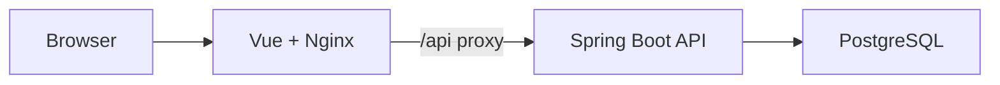

# Logitech Store Shopping Mall

Vue 3, Spring Boot, PostgreSQL로 만든 개인 쇼핑몰 프로젝트입니다.
회원, 상품, 장바구니, 주문, 리뷰, Q&A, 관리자 기능을 분리된 프론트엔드/백엔드 구조로 구현했습니다.

## Tech Stack

- Frontend: Vue 3, Composition API, Vue Router, Pinia, Axios, Bootstrap
- Backend: Java 21, Spring Boot 3, Spring Security, Spring Data JPA, Gradle
- Database: PostgreSQL
- Deploy: Docker Compose, Nginx
- Static assets: Spring Boot static resources, Vite public assets

## Architecture



## Main Features

- 회원가입, 로그인, 로그아웃, 마이페이지
- 상품 목록/상세 조회
- 장바구니 추가, 조회, 삭제
- 주문 생성, 주문 내역/상세 조회
- 리뷰 등록/수정/삭제
- Q&A 질문/답변, 수정/삭제
- 관리자 대시보드, 회원/상품/주문/리뷰/Q&A 관리

## Project Structure

```text
logitech-frontend/logitech-vue
  src/api          shared axios client
  src/components   reusable UI components
  src/router       route and auth guard definitions
  src/services     API client functions
  src/store        Pinia stores
  src/views        page-level views

logitech-backend/logitech
  src/main/java/com/example/Logitech
    config         security and password config
    controller     REST controllers and exception handling
    domain         JPA entities
    dto            request/response DTOs
    repository     Spring Data repositories
    service        business logic

logitech-backend/postgresql/init-scripts
  01-init.sql      local Docker seed schema/data
```

## Local Run

### Docker Compose

```bash
docker compose up --build
```

- Frontend: http://localhost:5173
- Backend: http://localhost:8090
- PostgreSQL: localhost:5433

### Test Accounts

| Role | ID | Password |
| --- | --- | --- |
| Admin | admin1 | 1234 |
| User | user100 | 1234 |

## Environment

Backend defaults are defined in `logitech-backend/logitech/src/main/resources/application.yml`.

| Variable | Default |
| --- | --- |
| `SPRING_DATASOURCE_URL` | `jdbc:postgresql://localhost:5433/logitech` |
| `SPRING_DATASOURCE_USERNAME` | `logitech` |
| `SPRING_DATASOURCE_PASSWORD` | `logitech1234` |
| `APP_CORS_ALLOWED_ORIGINS` | `http://localhost:5173,http://127.0.0.1:5173` |

Frontend API base URL is controlled by:

```env
VITE_API_BASE_URL=http://localhost:8090
```

Docker builds the frontend with `VITE_API_BASE_URL=/api` and Nginx proxies `/api/*` to the backend container.

Nginx also proxies `/images/*` to the backend so product images served from Spring Boot static resources are available in the Docker frontend.

The favicon is served from `logitech-frontend/logitech-vue/public/favicon.png`.

## API Overview

| Feature | Method | Endpoint |
| --- | --- | --- |
| Join | POST | `/members/join` |
| Login | POST | `/members/login` |
| Login check | GET | `/members/check` |
| Items | GET | `/items/list` |
| Item detail | GET | `/items/detail/{itemId}` |
| Cart list | GET | `/carts/list` |
| Add cart item | POST | `/carts/add` |
| Create order | POST | `/orders/new` |
| My orders | GET | `/orders/list/{memberId}` |
| Q&A list | GET | `/qna/list` |
| Q&A question | POST | `/qna/question` |
| Review create | POST | `/reviews/new` |
| Admin dashboard | GET | `/admin/dashboard` |

## Notes

- API responses use DTOs instead of exposing JPA entities directly.
- Request validation and exception-to-response mapping are handled on the backend.
- The frontend uses a shared Axios client in `src/api/axios.js`.
- Docker seed data is for portfolio/demo use only.
- Product images are stored under `logitech-backend/logitech/src/main/resources/static/images/items`.
